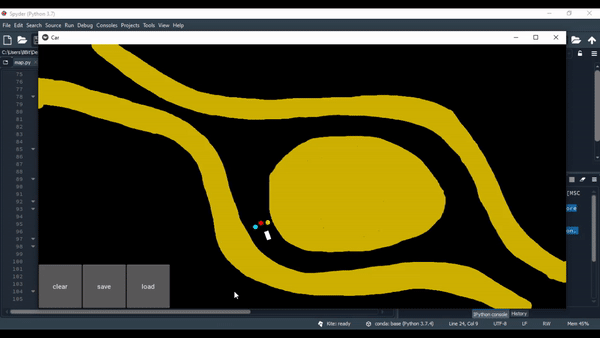

# self-driving-car
A cute 2D car leverages a Deep Q Machine Learning model to try and not hit the walls. You can draw any track you want, and the car will try and learn to adapt to the situation (so it doesn't hit the wall).

